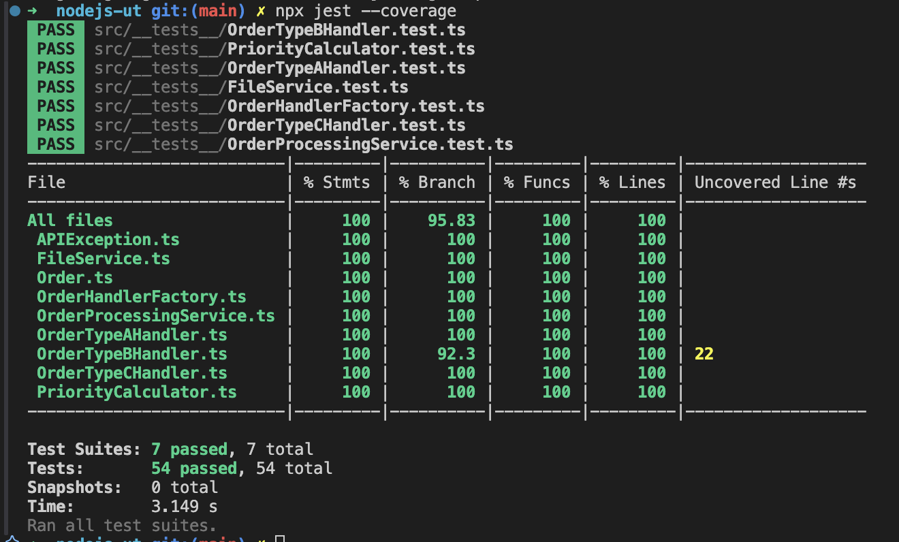

# Node.js Unit Testing Practice

## Description
This project is a practice exercise for writing unit tests in a Node.js application. It includes handlers for processing different types of orders, services for interacting with APIs and databases, and utilities for calculating priorities.

## Features
- Comprehensive unit tests for all components.
- Edge case handling for various scenarios.
- Mocking and stubbing of external dependencies.

## Evidence


## How to Run Tests
1. Install dependencies:
    ```bash
    npm install
    ```

2. Run tests:
    ```bash
    npm test
    ```

3. Generate coverage report:
    ```bash
    npx jest --coverage
    ```

